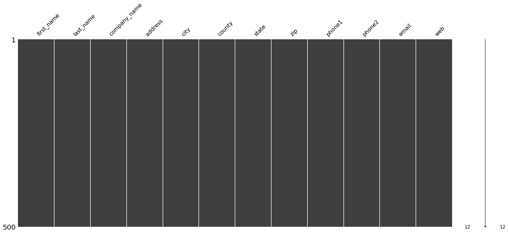
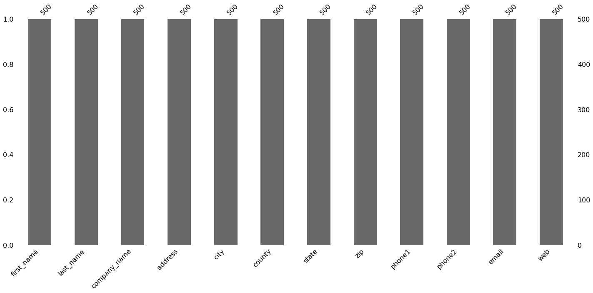

# PARTE 1

Faça o download da base de dados ‘us-500.csv’ do link https://www.briandunning.com/sample-data/
* Cheque se há algum dado faltante na base de dados ‘us-500’;
* Classifique os endereços por ‘state’;
* Suponha que o zip code deve sempre ter 5 dígitos, ache todos os zip codes
irregulares;
* Separe a coluna ‘address’ em três partes: o número na rua, o nome da rua e o
número de quartos. (Considere que pode haver partes faltantes)
Ex. 8 W Cerritos Ave #54 → ‘8’, ‘W Cerritos Ave’, ‘ #54’
6649 N Blue Gum St → ‘6649’, ‘N Blue Gum St’, ‘ ‘.
______________________________

#### Instalando biblioteca missingno

'missingno' fornece um pequeno conjunto de ferramentas de visualizações e utilitários de dados perdidos flexíveis e fáceis de usar que permite obter um rápido resumo visual da integridade (ou falta dela) do seu conjunto de dados.


```python
!pip install missingno
```

    Requirement already satisfied: missingno in c:\users\guilherme\anaconda3\lib\site-packages (0.4.2)
    Requirement already satisfied: seaborn in c:\users\guilherme\anaconda3\lib\site-packages (from missingno) (0.11.0)
    Requirement already satisfied: numpy in c:\users\guilherme\anaconda3\lib\site-packages (from missingno) (1.19.2)
    Requirement already satisfied: matplotlib in c:\users\guilherme\anaconda3\lib\site-packages (from missingno) (3.3.2)
    Requirement already satisfied: scipy in c:\users\guilherme\anaconda3\lib\site-packages (from missingno) (1.5.2)
    Requirement already satisfied: pandas>=0.23 in c:\users\guilherme\anaconda3\lib\site-packages (from seaborn->missingno) (1.1.3)
    Requirement already satisfied: cycler>=0.10 in c:\users\guilherme\anaconda3\lib\site-packages (from matplotlib->missingno) (0.10.0)
    Requirement already satisfied: pillow>=6.2.0 in c:\users\guilherme\anaconda3\lib\site-packages (from matplotlib->missingno) (8.0.1)
    Requirement already satisfied: certifi>=2020.06.20 in c:\users\guilherme\anaconda3\lib\site-packages (from matplotlib->missingno) (2020.6.20)
    Requirement already satisfied: pyparsing!=2.0.4,!=2.1.2,!=2.1.6,>=2.0.3 in c:\users\guilherme\anaconda3\lib\site-packages (from matplotlib->missingno) (2.4.7)
    Requirement already satisfied: python-dateutil>=2.1 in c:\users\guilherme\anaconda3\lib\site-packages (from matplotlib->missingno) (2.8.1)
    Requirement already satisfied: kiwisolver>=1.0.1 in c:\users\guilherme\anaconda3\lib\site-packages (from matplotlib->missingno) (1.3.0)
    Requirement already satisfied: pytz>=2017.2 in c:\users\guilherme\anaconda3\lib\site-packages (from pandas>=0.23->seaborn->missingno) (2020.1)
    Requirement already satisfied: six in c:\users\guilherme\anaconda3\lib\site-packages (from cycler>=0.10->matplotlib->missingno) (1.15.0)
    

#### Importando bibliotecas que serão utilizadas


```python
import pandas as pd
import missingno as msno
```

#### Carregando dataset


```python
df = pd.read_csv("us-500.csv")
```

#### Visualizando dataset


```python
df
```


<div>
<style scoped>
    .dataframe tbody tr th:only-of-type {
        vertical-align: middle;
    }

    .dataframe tbody tr th {
        vertical-align: top;
    }

    .dataframe thead th {
        text-align: right;
    }
</style>
<table border="1" class="dataframe">
  <thead>
    <tr style="text-align: right;">
      <th></th>
      <th>first_name</th>
      <th>last_name</th>
      <th>company_name</th>
      <th>address</th>
      <th>city</th>
      <th>county</th>
      <th>state</th>
      <th>zip</th>
      <th>phone1</th>
      <th>phone2</th>
      <th>email</th>
      <th>web</th>
    </tr>
  </thead>
  <tbody>
    <tr>
      <th>0</th>
      <td>James</td>
      <td>Butt</td>
      <td>Benton, John B Jr</td>
      <td>6649 N Blue Gum St</td>
      <td>New Orleans</td>
      <td>Orleans</td>
      <td>LA</td>
      <td>70116</td>
      <td>504-621-8927</td>
      <td>504-845-1427</td>
      <td>jbutt@gmail.com</td>
      <td>http://www.bentonjohnbjr.com</td>
    </tr>
    <tr>
      <th>1</th>
      <td>Josephine</td>
      <td>Darakjy</td>
      <td>Chanay, Jeffrey A Esq</td>
      <td>4 B Blue Ridge Blvd</td>
      <td>Brighton</td>
      <td>Livingston</td>
      <td>MI</td>
      <td>48116</td>
      <td>810-292-9388</td>
      <td>810-374-9840</td>
      <td>josephine_darakjy@darakjy.org</td>
      <td>http://www.chanayjeffreyaesq.com</td>
    </tr>
    <tr>
      <th>2</th>
      <td>Art</td>
      <td>Venere</td>
      <td>Chemel, James L Cpa</td>
      <td>8 W Cerritos Ave #54</td>
      <td>Bridgeport</td>
      <td>Gloucester</td>
      <td>NJ</td>
      <td>8014</td>
      <td>856-636-8749</td>
      <td>856-264-4130</td>
      <td>art@venere.org</td>
      <td>http://www.chemeljameslcpa.com</td>
    </tr>
    <tr>
      <th>3</th>
      <td>Lenna</td>
      <td>Paprocki</td>
      <td>Feltz Printing Service</td>
      <td>639 Main St</td>
      <td>Anchorage</td>
      <td>Anchorage</td>
      <td>AK</td>
      <td>99501</td>
      <td>907-385-4412</td>
      <td>907-921-2010</td>
      <td>lpaprocki@hotmail.com</td>
      <td>http://www.feltzprintingservice.com</td>
    </tr>
    <tr>
      <th>4</th>
      <td>Donette</td>
      <td>Foller</td>
      <td>Printing Dimensions</td>
      <td>34 Center St</td>
      <td>Hamilton</td>
      <td>Butler</td>
      <td>OH</td>
      <td>45011</td>
      <td>513-570-1893</td>
      <td>513-549-4561</td>
      <td>donette.foller@cox.net</td>
      <td>http://www.printingdimensions.com</td>
    </tr>
    <tr>
      <th>...</th>
      <td>...</td>
      <td>...</td>
      <td>...</td>
      <td>...</td>
      <td>...</td>
      <td>...</td>
      <td>...</td>
      <td>...</td>
      <td>...</td>
      <td>...</td>
      <td>...</td>
      <td>...</td>
    </tr>
    <tr>
      <th>495</th>
      <td>Brittni</td>
      <td>Gillaspie</td>
      <td>Inner Label</td>
      <td>67 Rv Cent</td>
      <td>Boise</td>
      <td>Ada</td>
      <td>ID</td>
      <td>83709</td>
      <td>208-709-1235</td>
      <td>208-206-9848</td>
      <td>bgillaspie@gillaspie.com</td>
      <td>http://www.innerlabel.com</td>
    </tr>
    <tr>
      <th>496</th>
      <td>Raylene</td>
      <td>Kampa</td>
      <td>Hermar Inc</td>
      <td>2 Sw Nyberg Rd</td>
      <td>Elkhart</td>
      <td>Elkhart</td>
      <td>IN</td>
      <td>46514</td>
      <td>574-499-1454</td>
      <td>574-330-1884</td>
      <td>rkampa@kampa.org</td>
      <td>http://www.hermarinc.com</td>
    </tr>
    <tr>
      <th>497</th>
      <td>Flo</td>
      <td>Bookamer</td>
      <td>Simonton Howe &amp; Schneider Pc</td>
      <td>89992 E 15th St</td>
      <td>Alliance</td>
      <td>Box Butte</td>
      <td>NE</td>
      <td>69301</td>
      <td>308-726-2182</td>
      <td>308-250-6987</td>
      <td>flo.bookamer@cox.net</td>
      <td>http://www.simontonhoweschneiderpc.com</td>
    </tr>
    <tr>
      <th>498</th>
      <td>Jani</td>
      <td>Biddy</td>
      <td>Warehouse Office &amp; Paper Prod</td>
      <td>61556 W 20th Ave</td>
      <td>Seattle</td>
      <td>King</td>
      <td>WA</td>
      <td>98104</td>
      <td>206-711-6498</td>
      <td>206-395-6284</td>
      <td>jbiddy@yahoo.com</td>
      <td>http://www.warehouseofficepaperprod.com</td>
    </tr>
    <tr>
      <th>499</th>
      <td>Chauncey</td>
      <td>Motley</td>
      <td>Affiliated With Travelodge</td>
      <td>63 E Aurora Dr</td>
      <td>Orlando</td>
      <td>Orange</td>
      <td>FL</td>
      <td>32804</td>
      <td>407-413-4842</td>
      <td>407-557-8857</td>
      <td>chauncey_motley@aol.com</td>
      <td>http://www.affiliatedwithtravelodge.com</td>
    </tr>
  </tbody>
</table>
<p>500 rows × 12 columns</p>
</div>


### A. Cheque se há algum dado faltante na base de dados ‘us-500’;

A matriz de nulidade `msno.matrix` é uma exibição densa de dados que permite selecionar visualmente os dados faltantes.


```python
msno.matrix(df)
```


    <AxesSubplot:>


    

    


Com esse gráfico, podemos identificar que nossa base de dados possui 500 linhas, 12 colunas e nenhum dado faltando.
Os dados faltantes apareceriam em branco (Exemplo: https://github.com/GuilhermeMonteiroPeixoto/Data-Analysis-and-Visualization/tree/master/Python-libraries/UseMissingno).

O comando `msno.bar` mostra outra maneira de mostrar dados faltantes usando gráfico de barras. Essas barras mostram valores que são proporcionais aos dados ausentes e não ausentes no conjunto de dados.


```python
msno.bar(df)
```


    <AxesSubplot:>


    

    


Assim, podemos afirmar que não há dados faltantes na nossa base de dados.

## B. Classifique os endereços por ‘state’;

Use a função `groupby()` para formar grupos com base em uma ou mais categorias


```python
df_groupbystate = df.groupby(['state', 'address'])
```


```python
df_groupbystate.first()
```


<div>
<style scoped>
    .dataframe tbody tr th:only-of-type {
        vertical-align: middle;
    }

    .dataframe tbody tr th {
        vertical-align: top;
    }

    .dataframe thead th {
        text-align: right;
    }
</style>
<table border="1" class="dataframe">
  <thead>
    <tr style="text-align: right;">
      <th></th>
      <th></th>
      <th>first_name</th>
      <th>last_name</th>
      <th>company_name</th>
      <th>city</th>
      <th>county</th>
      <th>zip</th>
      <th>phone1</th>
      <th>phone2</th>
      <th>email</th>
      <th>web</th>
    </tr>
    <tr>
      <th>state</th>
      <th>address</th>
      <th></th>
      <th></th>
      <th></th>
      <th></th>
      <th></th>
      <th></th>
      <th></th>
      <th></th>
      <th></th>
      <th></th>
    </tr>
  </thead>
  <tbody>
    <tr>
      <th rowspan="5" valign="top">AK</th>
      <th>1048 Main St</th>
      <td>Roxane</td>
      <td>Campain</td>
      <td>Rapid Trading Intl</td>
      <td>Fairbanks</td>
      <td>Fairbanks North Star</td>
      <td>99708</td>
      <td>907-231-4722</td>
      <td>907-335-6568</td>
      <td>roxane@hotmail.com</td>
      <td>http://www.rapidtradingintl.com</td>
    </tr>
    <tr>
      <th>1747 Calle Amanecer #2</th>
      <td>Wilda</td>
      <td>Giguere</td>
      <td>Mclaughlin, Luther W Cpa</td>
      <td>Anchorage</td>
      <td>Anchorage</td>
      <td>99501</td>
      <td>907-870-5536</td>
      <td>907-914-9482</td>
      <td>wilda@cox.net</td>
      <td>http://www.mclaughlinlutherwcpa.com</td>
    </tr>
    <tr>
      <th>18 Fountain St</th>
      <td>Penney</td>
      <td>Weight</td>
      <td>Hawaiian King Hotel</td>
      <td>Anchorage</td>
      <td>Anchorage</td>
      <td>99515</td>
      <td>907-797-9628</td>
      <td>907-873-2882</td>
      <td>penney_weight@aol.com</td>
      <td>http://www.hawaiiankinghotel.com</td>
    </tr>
    <tr>
      <th>20 S Babcock St</th>
      <td>Erick</td>
      <td>Ferencz</td>
      <td>Cindy Turner Associates</td>
      <td>Fairbanks</td>
      <td>Fairbanks North Star</td>
      <td>99712</td>
      <td>907-741-1044</td>
      <td>907-227-6777</td>
      <td>erick.ferencz@aol.com</td>
      <td>http://www.cindyturnerassociates.com</td>
    </tr>
    <tr>
      <th>639 Main St</th>
      <td>Lenna</td>
      <td>Paprocki</td>
      <td>Feltz Printing Service</td>
      <td>Anchorage</td>
      <td>Anchorage</td>
      <td>99501</td>
      <td>907-385-4412</td>
      <td>907-921-2010</td>
      <td>lpaprocki@hotmail.com</td>
      <td>http://www.feltzprintingservice.com</td>
    </tr>
    <tr>
      <th>...</th>
      <th>...</th>
      <td>...</td>
      <td>...</td>
      <td>...</td>
      <td>...</td>
      <td>...</td>
      <td>...</td>
      <td>...</td>
      <td>...</td>
      <td>...</td>
      <td>...</td>
    </tr>
    <tr>
      <th rowspan="2" valign="top">WI</th>
      <th>762 S Main St</th>
      <td>Emerson</td>
      <td>Bowley</td>
      <td>Knights Inn</td>
      <td>Madison</td>
      <td>Dane</td>
      <td>53711</td>
      <td>608-336-7444</td>
      <td>608-658-7940</td>
      <td>emerson.bowley@bowley.org</td>
      <td>http://www.knightsinn.com</td>
    </tr>
    <tr>
      <th>9 N College Ave #3</th>
      <td>Daren</td>
      <td>Weirather</td>
      <td>Panasystems</td>
      <td>Milwaukee</td>
      <td>Milwaukee</td>
      <td>53216</td>
      <td>414-959-2540</td>
      <td>414-838-3151</td>
      <td>dweirather@aol.com</td>
      <td>http://www.panasystems.com</td>
    </tr>
    <tr>
      <th rowspan="3" valign="top">WY</th>
      <th>38773 Gravois Ave</th>
      <td>Mona</td>
      <td>Delasancha</td>
      <td>Sign All</td>
      <td>Cheyenne</td>
      <td>Laramie</td>
      <td>82001</td>
      <td>307-403-1488</td>
      <td>307-816-7115</td>
      <td>mdelasancha@hotmail.com</td>
      <td>http://www.signall.com</td>
    </tr>
    <tr>
      <th>66697 Park Pl #3224</th>
      <td>Lauran</td>
      <td>Burnard</td>
      <td>Professionals Unlimited</td>
      <td>Riverton</td>
      <td>Fremont</td>
      <td>82501</td>
      <td>307-342-7795</td>
      <td>307-453-7589</td>
      <td>lburnard@burnard.com</td>
      <td>http://www.professionalsunlimited.com</td>
    </tr>
    <tr>
      <th>7140 University Ave</th>
      <td>Natalie</td>
      <td>Fern</td>
      <td>Kelly, Charles G Esq</td>
      <td>Rock Springs</td>
      <td>Sweetwater</td>
      <td>82901</td>
      <td>307-704-8713</td>
      <td>307-279-3793</td>
      <td>natalie.fern@hotmail.com</td>
      <td>http://www.kellycharlesgesq.com</td>
    </tr>
  </tbody>
</table>
<p>500 rows × 10 columns</p>
</div>


Agora podemos visualizar os endereços classificados por estado.

Outra opção viável é organizar a tabela por ordem alfabetica da coluna 'state'. 


```python
df.sort_values(by='state',inplace=True)
df
```


<div>
<style scoped>
    .dataframe tbody tr th:only-of-type {
        vertical-align: middle;
    }

    .dataframe tbody tr th {
        vertical-align: top;
    }

    .dataframe thead th {
        text-align: right;
    }
</style>
<table border="1" class="dataframe">
  <thead>
    <tr style="text-align: right;">
      <th></th>
      <th>first_name</th>
      <th>last_name</th>
      <th>company_name</th>
      <th>address</th>
      <th>city</th>
      <th>county</th>
      <th>state</th>
      <th>zip</th>
      <th>phone1</th>
      <th>phone2</th>
      <th>email</th>
      <th>web</th>
    </tr>
  </thead>
  <tbody>
    <tr>
      <th>386</th>
      <td>Gail</td>
      <td>Kitty</td>
      <td>Service Supply Co Inc</td>
      <td>735 Crawford Dr</td>
      <td>Anchorage</td>
      <td>Anchorage</td>
      <td>AK</td>
      <td>99501</td>
      <td>907-435-9166</td>
      <td>907-770-3542</td>
      <td>gail@kitty.com</td>
      <td>http://www.servicesupplycoinc.com</td>
    </tr>
    <tr>
      <th>66</th>
      <td>Penney</td>
      <td>Weight</td>
      <td>Hawaiian King Hotel</td>
      <td>18 Fountain St</td>
      <td>Anchorage</td>
      <td>Anchorage</td>
      <td>AK</td>
      <td>99515</td>
      <td>907-797-9628</td>
      <td>907-873-2882</td>
      <td>penney_weight@aol.com</td>
      <td>http://www.hawaiiankinghotel.com</td>
    </tr>
    <tr>
      <th>3</th>
      <td>Lenna</td>
      <td>Paprocki</td>
      <td>Feltz Printing Service</td>
      <td>639 Main St</td>
      <td>Anchorage</td>
      <td>Anchorage</td>
      <td>AK</td>
      <td>99501</td>
      <td>907-385-4412</td>
      <td>907-921-2010</td>
      <td>lpaprocki@hotmail.com</td>
      <td>http://www.feltzprintingservice.com</td>
    </tr>
    <tr>
      <th>42</th>
      <td>Roxane</td>
      <td>Campain</td>
      <td>Rapid Trading Intl</td>
      <td>1048 Main St</td>
      <td>Fairbanks</td>
      <td>Fairbanks North Star</td>
      <td>AK</td>
      <td>99708</td>
      <td>907-231-4722</td>
      <td>907-335-6568</td>
      <td>roxane@hotmail.com</td>
      <td>http://www.rapidtradingintl.com</td>
    </tr>
    <tr>
      <th>44</th>
      <td>Erick</td>
      <td>Ferencz</td>
      <td>Cindy Turner Associates</td>
      <td>20 S Babcock St</td>
      <td>Fairbanks</td>
      <td>Fairbanks North Star</td>
      <td>AK</td>
      <td>99712</td>
      <td>907-741-1044</td>
      <td>907-227-6777</td>
      <td>erick.ferencz@aol.com</td>
      <td>http://www.cindyturnerassociates.com</td>
    </tr>
    <tr>
      <th>...</th>
      <td>...</td>
      <td>...</td>
      <td>...</td>
      <td>...</td>
      <td>...</td>
      <td>...</td>
      <td>...</td>
      <td>...</td>
      <td>...</td>
      <td>...</td>
      <td>...</td>
      <td>...</td>
    </tr>
    <tr>
      <th>48</th>
      <td>Emerson</td>
      <td>Bowley</td>
      <td>Knights Inn</td>
      <td>762 S Main St</td>
      <td>Madison</td>
      <td>Dane</td>
      <td>WI</td>
      <td>53711</td>
      <td>608-336-7444</td>
      <td>608-658-7940</td>
      <td>emerson.bowley@bowley.org</td>
      <td>http://www.knightsinn.com</td>
    </tr>
    <tr>
      <th>337</th>
      <td>Kate</td>
      <td>Keneipp</td>
      <td>Davis, Maxon R Esq</td>
      <td>33 N Michigan Ave</td>
      <td>Green Bay</td>
      <td>Brown</td>
      <td>WI</td>
      <td>54301</td>
      <td>920-353-6377</td>
      <td>920-355-1610</td>
      <td>kate_keneipp@yahoo.com</td>
      <td>http://www.davismaxonresq.com</td>
    </tr>
    <tr>
      <th>481</th>
      <td>Mona</td>
      <td>Delasancha</td>
      <td>Sign All</td>
      <td>38773 Gravois Ave</td>
      <td>Cheyenne</td>
      <td>Laramie</td>
      <td>WY</td>
      <td>82001</td>
      <td>307-403-1488</td>
      <td>307-816-7115</td>
      <td>mdelasancha@hotmail.com</td>
      <td>http://www.signall.com</td>
    </tr>
    <tr>
      <th>241</th>
      <td>Lauran</td>
      <td>Burnard</td>
      <td>Professionals Unlimited</td>
      <td>66697 Park Pl #3224</td>
      <td>Riverton</td>
      <td>Fremont</td>
      <td>WY</td>
      <td>82501</td>
      <td>307-342-7795</td>
      <td>307-453-7589</td>
      <td>lburnard@burnard.com</td>
      <td>http://www.professionalsunlimited.com</td>
    </tr>
    <tr>
      <th>97</th>
      <td>Natalie</td>
      <td>Fern</td>
      <td>Kelly, Charles G Esq</td>
      <td>7140 University Ave</td>
      <td>Rock Springs</td>
      <td>Sweetwater</td>
      <td>WY</td>
      <td>82901</td>
      <td>307-704-8713</td>
      <td>307-279-3793</td>
      <td>natalie.fern@hotmail.com</td>
      <td>http://www.kellycharlesgesq.com</td>
    </tr>
  </tbody>
</table>
<p>500 rows × 12 columns</p>
</div>


## C. Suponha que o zip code deve sempre ter 5 dígitos, ache todos os zip codes irregulares;

Podemos usar a função `loc` para selecionarmos apenas as linhas com zip codes irregulares, usando `df['zip'].astype(str).str.len() != 5` como argumento.


```python
df.loc[(df['zip'].astype(str).str.len() != 5)]
```


<div>
<style scoped>
    .dataframe tbody tr th:only-of-type {
        vertical-align: middle;
    }

    .dataframe tbody tr th {
        vertical-align: top;
    }

    .dataframe thead th {
        text-align: right;
    }
</style>
<table border="1" class="dataframe">
  <thead>
    <tr style="text-align: right;">
      <th></th>
      <th>first_name</th>
      <th>last_name</th>
      <th>company_name</th>
      <th>address</th>
      <th>city</th>
      <th>county</th>
      <th>state</th>
      <th>zip</th>
      <th>phone1</th>
      <th>phone2</th>
      <th>email</th>
      <th>web</th>
    </tr>
  </thead>
  <tbody>
    <tr>
      <th>235</th>
      <td>Yoko</td>
      <td>Fishburne</td>
      <td>Sams Corner Store</td>
      <td>9122 Carpenter Ave</td>
      <td>New Haven</td>
      <td>New Haven</td>
      <td>CT</td>
      <td>6511</td>
      <td>203-506-4706</td>
      <td>203-840-8634</td>
      <td>yoko@fishburne.com</td>
      <td>http://www.samscornerstore.com</td>
    </tr>
    <tr>
      <th>373</th>
      <td>Zona</td>
      <td>Colla</td>
      <td>Solove, Robert A Esq</td>
      <td>49440 Dearborn St</td>
      <td>Norwalk</td>
      <td>Fairfield</td>
      <td>CT</td>
      <td>6854</td>
      <td>203-461-1949</td>
      <td>203-938-2557</td>
      <td>zona@hotmail.com</td>
      <td>http://www.soloverobertaesq.com</td>
    </tr>
    <tr>
      <th>275</th>
      <td>Ma</td>
      <td>Layous</td>
      <td>Development Authority</td>
      <td>78112 Morris Ave</td>
      <td>North Haven</td>
      <td>New Haven</td>
      <td>CT</td>
      <td>6473</td>
      <td>203-721-3388</td>
      <td>203-564-1543</td>
      <td>mlayous@hotmail.com</td>
      <td>http://www.developmentauthority.com</td>
    </tr>
    <tr>
      <th>265</th>
      <td>Harrison</td>
      <td>Haufler</td>
      <td>John Wagner Associates</td>
      <td>759 Eldora St</td>
      <td>New Haven</td>
      <td>New Haven</td>
      <td>CT</td>
      <td>6515</td>
      <td>203-801-6193</td>
      <td>203-801-8497</td>
      <td>hhaufler@hotmail.com</td>
      <td>http://www.johnwagnerassociates.com</td>
    </tr>
    <tr>
      <th>403</th>
      <td>Teddy</td>
      <td>Pedrozo</td>
      <td>Barkan, Neal J Esq</td>
      <td>46314 Route 130</td>
      <td>Bridgeport</td>
      <td>Fairfield</td>
      <td>CT</td>
      <td>6610</td>
      <td>203-892-3863</td>
      <td>203-918-3939</td>
      <td>teddy_pedrozo@aol.com</td>
      <td>http://www.barkannealjesq.com</td>
    </tr>
    <tr>
      <th>...</th>
      <td>...</td>
      <td>...</td>
      <td>...</td>
      <td>...</td>
      <td>...</td>
      <td>...</td>
      <td>...</td>
      <td>...</td>
      <td>...</td>
      <td>...</td>
      <td>...</td>
      <td>...</td>
    </tr>
    <tr>
      <th>319</th>
      <td>Caitlin</td>
      <td>Julia</td>
      <td>Helderman, Seymour Cpa</td>
      <td>5 Williams St</td>
      <td>Johnston</td>
      <td>Providence</td>
      <td>RI</td>
      <td>2919</td>
      <td>401-948-4982</td>
      <td>401-552-9059</td>
      <td>caitlin.julia@julia.org</td>
      <td>http://www.heldermanseymourcpa.com</td>
    </tr>
    <tr>
      <th>317</th>
      <td>Hermila</td>
      <td>Thyberg</td>
      <td>Chilton Malting Co</td>
      <td>1 Rancho Del Mar Shopping C</td>
      <td>Providence</td>
      <td>Providence</td>
      <td>RI</td>
      <td>2903</td>
      <td>401-893-4882</td>
      <td>401-885-7681</td>
      <td>hermila_thyberg@hotmail.com</td>
      <td>http://www.chiltonmaltingco.com</td>
    </tr>
    <tr>
      <th>60</th>
      <td>Blondell</td>
      <td>Pugh</td>
      <td>Alpenlite Inc</td>
      <td>201 Hawk Ct</td>
      <td>Providence</td>
      <td>Providence</td>
      <td>RI</td>
      <td>2904</td>
      <td>401-960-8259</td>
      <td>401-300-8122</td>
      <td>bpugh@aol.com</td>
      <td>http://www.alpenliteinc.com</td>
    </tr>
    <tr>
      <th>58</th>
      <td>Delmy</td>
      <td>Ahle</td>
      <td>Wye Technologies Inc</td>
      <td>65895 S 16th St</td>
      <td>Providence</td>
      <td>Providence</td>
      <td>RI</td>
      <td>2909</td>
      <td>401-458-2547</td>
      <td>401-559-8961</td>
      <td>delmy.ahle@hotmail.com</td>
      <td>http://www.wyetechnologiesinc.com</td>
    </tr>
    <tr>
      <th>489</th>
      <td>Lawrence</td>
      <td>Lorens</td>
      <td>New England Sec Equip Co Inc</td>
      <td>9 Hwy</td>
      <td>Providence</td>
      <td>Providence</td>
      <td>RI</td>
      <td>2906</td>
      <td>401-465-6432</td>
      <td>401-893-1820</td>
      <td>lawrence.lorens@hotmail.com</td>
      <td>http://www.newenglandsecequipcoinc.com</td>
    </tr>
  </tbody>
</table>
<p>78 rows × 12 columns</p>
</div>


Assumindo que você prefira retirar as linhas com zip codes irregulares, use a função `drop` e passe `df.loc[(df['zip'].astype(str).str.len() != 5)]` como argumento.


```python
df.drop(df.loc[(df['zip'].astype(str).str.len() != 5)].index, inplace = True)
```

## D. Separe a coluna ‘address’ em três partes: o número na rua, o nome da rua e o número de quartos. (Considere que pode haver partes faltantes)

O jeito mais elegante para se fazer isso, é usando expressões regulares.

Então, primeiro vamos criar novas colunas que receberão `df.address.str.extract('ER', expand = True)`


```python
df['numero_rua'] = df.address.str.extract('(\d+ )', expand = True)
df['nome_rua'] = df.address.str.extract(r'([a-zA-Z].+[a-zA-Z])', expand = True)
df['numero_quartos'] = df.address.str.extract(r'(#.+)$', expand = True)
```

Em seguinda, retiramos a coluna address usando `drop`


```python
df.drop('address', axis=1, inplace=True)
```

#### Visualizando o novo dataset


```python
df
```


<div>
<style scoped>
    .dataframe tbody tr th:only-of-type {
        vertical-align: middle;
    }

    .dataframe tbody tr th {
        vertical-align: top;
    }

    .dataframe thead th {
        text-align: right;
    }
</style>
<table border="1" class="dataframe">
  <thead>
    <tr style="text-align: right;">
      <th></th>
      <th>first_name</th>
      <th>last_name</th>
      <th>company_name</th>
      <th>city</th>
      <th>county</th>
      <th>state</th>
      <th>zip</th>
      <th>phone1</th>
      <th>phone2</th>
      <th>email</th>
      <th>web</th>
      <th>numero_rua</th>
      <th>nome_rua</th>
      <th>numero_quartos</th>
    </tr>
  </thead>
  <tbody>
    <tr>
      <th>386</th>
      <td>Gail</td>
      <td>Kitty</td>
      <td>Service Supply Co Inc</td>
      <td>Anchorage</td>
      <td>Anchorage</td>
      <td>AK</td>
      <td>99501</td>
      <td>907-435-9166</td>
      <td>907-770-3542</td>
      <td>gail@kitty.com</td>
      <td>http://www.servicesupplycoinc.com</td>
      <td>735</td>
      <td>Crawford Dr</td>
      <td>NaN</td>
    </tr>
    <tr>
      <th>66</th>
      <td>Penney</td>
      <td>Weight</td>
      <td>Hawaiian King Hotel</td>
      <td>Anchorage</td>
      <td>Anchorage</td>
      <td>AK</td>
      <td>99515</td>
      <td>907-797-9628</td>
      <td>907-873-2882</td>
      <td>penney_weight@aol.com</td>
      <td>http://www.hawaiiankinghotel.com</td>
      <td>18</td>
      <td>Fountain St</td>
      <td>NaN</td>
    </tr>
    <tr>
      <th>3</th>
      <td>Lenna</td>
      <td>Paprocki</td>
      <td>Feltz Printing Service</td>
      <td>Anchorage</td>
      <td>Anchorage</td>
      <td>AK</td>
      <td>99501</td>
      <td>907-385-4412</td>
      <td>907-921-2010</td>
      <td>lpaprocki@hotmail.com</td>
      <td>http://www.feltzprintingservice.com</td>
      <td>639</td>
      <td>Main St</td>
      <td>NaN</td>
    </tr>
    <tr>
      <th>42</th>
      <td>Roxane</td>
      <td>Campain</td>
      <td>Rapid Trading Intl</td>
      <td>Fairbanks</td>
      <td>Fairbanks North Star</td>
      <td>AK</td>
      <td>99708</td>
      <td>907-231-4722</td>
      <td>907-335-6568</td>
      <td>roxane@hotmail.com</td>
      <td>http://www.rapidtradingintl.com</td>
      <td>1048</td>
      <td>Main St</td>
      <td>NaN</td>
    </tr>
    <tr>
      <th>44</th>
      <td>Erick</td>
      <td>Ferencz</td>
      <td>Cindy Turner Associates</td>
      <td>Fairbanks</td>
      <td>Fairbanks North Star</td>
      <td>AK</td>
      <td>99712</td>
      <td>907-741-1044</td>
      <td>907-227-6777</td>
      <td>erick.ferencz@aol.com</td>
      <td>http://www.cindyturnerassociates.com</td>
      <td>20</td>
      <td>S Babcock St</td>
      <td>NaN</td>
    </tr>
    <tr>
      <th>...</th>
      <td>...</td>
      <td>...</td>
      <td>...</td>
      <td>...</td>
      <td>...</td>
      <td>...</td>
      <td>...</td>
      <td>...</td>
      <td>...</td>
      <td>...</td>
      <td>...</td>
      <td>...</td>
      <td>...</td>
      <td>...</td>
    </tr>
    <tr>
      <th>48</th>
      <td>Emerson</td>
      <td>Bowley</td>
      <td>Knights Inn</td>
      <td>Madison</td>
      <td>Dane</td>
      <td>WI</td>
      <td>53711</td>
      <td>608-336-7444</td>
      <td>608-658-7940</td>
      <td>emerson.bowley@bowley.org</td>
      <td>http://www.knightsinn.com</td>
      <td>762</td>
      <td>S Main St</td>
      <td>NaN</td>
    </tr>
    <tr>
      <th>337</th>
      <td>Kate</td>
      <td>Keneipp</td>
      <td>Davis, Maxon R Esq</td>
      <td>Green Bay</td>
      <td>Brown</td>
      <td>WI</td>
      <td>54301</td>
      <td>920-353-6377</td>
      <td>920-355-1610</td>
      <td>kate_keneipp@yahoo.com</td>
      <td>http://www.davismaxonresq.com</td>
      <td>33</td>
      <td>N Michigan Ave</td>
      <td>NaN</td>
    </tr>
    <tr>
      <th>481</th>
      <td>Mona</td>
      <td>Delasancha</td>
      <td>Sign All</td>
      <td>Cheyenne</td>
      <td>Laramie</td>
      <td>WY</td>
      <td>82001</td>
      <td>307-403-1488</td>
      <td>307-816-7115</td>
      <td>mdelasancha@hotmail.com</td>
      <td>http://www.signall.com</td>
      <td>38773</td>
      <td>Gravois Ave</td>
      <td>NaN</td>
    </tr>
    <tr>
      <th>241</th>
      <td>Lauran</td>
      <td>Burnard</td>
      <td>Professionals Unlimited</td>
      <td>Riverton</td>
      <td>Fremont</td>
      <td>WY</td>
      <td>82501</td>
      <td>307-342-7795</td>
      <td>307-453-7589</td>
      <td>lburnard@burnard.com</td>
      <td>http://www.professionalsunlimited.com</td>
      <td>66697</td>
      <td>Park Pl</td>
      <td>#3224</td>
    </tr>
    <tr>
      <th>97</th>
      <td>Natalie</td>
      <td>Fern</td>
      <td>Kelly, Charles G Esq</td>
      <td>Rock Springs</td>
      <td>Sweetwater</td>
      <td>WY</td>
      <td>82901</td>
      <td>307-704-8713</td>
      <td>307-279-3793</td>
      <td>natalie.fern@hotmail.com</td>
      <td>http://www.kellycharlesgesq.com</td>
      <td>7140</td>
      <td>University Ave</td>
      <td>NaN</td>
    </tr>
  </tbody>
</table>
<p>422 rows × 14 columns</p>
</div>


```python

```
