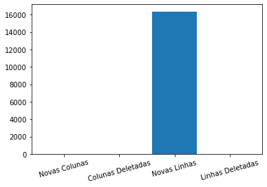

# PARTE 3

Download de duas base de dados sobre a vacinação em Alagoas.

As bases são de dias diferentes, sendo `data1` a mais antiga e `data2` a mais recente.

#### Importando bibliotecas que serão utilizadas


```python
import pandas as pd
import numpy as np
import matplotlib.pyplot as plt
```

#### Carregando dataset


```python
data1 = pd.read_csv('dados_AL1806.csv', sep=';')
data2 = pd.read_csv('part-00000-8031ffb6-c8db-4d3a-a2e9-40384eaae292.c000 (1).csv', sep=';')
```

#### Definindo `document_id` como index

É importante definir a chave primaria como index. Caso isso não seja feito, o index será gerado automaticamente e os datasets diferentes terão index diferentes para mesma linha.


```python
data1.set_index('document_id', inplace=True)
data2.set_index('document_id', inplace=True)
```

### Comparando as duas base de dados

#### Criando um função para identificar novas colunas, colunas deletadas, novas linhas e linhas deletadas

Para isso, vamos usar `pandas.index.difference` e `pandas.columns.difference`


```python
def compare(old, new):
    new_cols = new.columns.difference(old.columns)
    del_cols = old.columns.difference(new.columns)
    new_indx = new.index.difference(old.index)
    del_indx = old.index.difference(new.index)

    return new_cols, del_cols, new_indx, del_indx
```


```python
new_cols, del_cols, new_indx, del_indx = compare(data1, data2)
```

#### Plotando os dados

Comparando as duas bases de dados identificamos que não foi inserida nova coluna, não foi deletada nenhuma coluna e nenhuma linha foi deletada. Identificamos também o index de todas as linhas inseridas.


```python
print(f"""\
Novas colunas:

{' '.join(new_cols.astype(str))}

Colunas deletadas:

{' '.join(del_cols.astype(str))}

Novas linhas:

{' | '.join(new_indx.astype(str))}

Linhas deletadas:

{' '.join(del_indx.astype(str))}""")
```

Montando um gráfico para visualizar o número de novas colunas, colunas deletadas, novas linhas e linhas deletadas.


```python
plt.bar(['Novas Colunas','Colunas Deletadas','Novas Linhas', 'Linhas Deletadas'],[new_cols.size, del_cols.size, new_indx.size, del_indx.size])
plt.xticks(rotation=15)
plt.show()
```


    

    


#### Criando função para avaliar mudança

A função `comparechange` avalia qualquer mudança nos dados e retorna o index da linha, a coluna, o valor anterior e o valor atual.


```python
def comparechange(old, new):
    old, new = old.align(new)

    I, J = np.where(old.ne(new))
    c = old.columns
    r = old.index

    data = []
    for i, j in zip(I, J):
        n = new.iat[i, j]
        o = old.iat[i, j]
        if pd.notna(n) or pd.notna(o):
            data.append([r[i], c[j], o, n])

    return pd.DataFrame(data, columns=['Row', 'Column', 'Old', 'New'])
```


```python
changes = comparechange(data1, data2)
```


```python
changes
```


<div>
<style scoped>
    .dataframe tbody tr th:only-of-type {
        vertical-align: middle;
    }

    .dataframe tbody tr th {
        vertical-align: top;
    }

    .dataframe thead th {
        text-align: right;
    }
</style>
<table border="1" class="dataframe">
  <thead>
    <tr style="text-align: right;">
      <th></th>
      <th>Row</th>
      <th>Column</th>
      <th>Old</th>
      <th>New</th>
    </tr>
  </thead>
  <tbody>
    <tr>
      <th>0</th>
      <td>0008c538-23cb-47b2-b82d-d5e7c727117c-i0b0</td>
      <td>paciente_id</td>
      <td>NaN</td>
      <td>759c37edc87373fedf9f349bb2ef9e4c0b6fd58dc0eaf3...</td>
    </tr>
    <tr>
      <th>1</th>
      <td>0008c538-23cb-47b2-b82d-d5e7c727117c-i0b0</td>
      <td>paciente_idade</td>
      <td>NaN</td>
      <td>69</td>
    </tr>
    <tr>
      <th>2</th>
      <td>0008c538-23cb-47b2-b82d-d5e7c727117c-i0b0</td>
      <td>paciente_datanascimento</td>
      <td>NaN</td>
      <td>1951-12-24</td>
    </tr>
    <tr>
      <th>3</th>
      <td>0008c538-23cb-47b2-b82d-d5e7c727117c-i0b0</td>
      <td>paciente_enumsexobiologico</td>
      <td>NaN</td>
      <td>F</td>
    </tr>
    <tr>
      <th>4</th>
      <td>0008c538-23cb-47b2-b82d-d5e7c727117c-i0b0</td>
      <td>paciente_racacor_codigo</td>
      <td>NaN</td>
      <td>99</td>
    </tr>
    <tr>
      <th>...</th>
      <td>...</td>
      <td>...</td>
      <td>...</td>
      <td>...</td>
    </tr>
    <tr>
      <th>517994</th>
      <td>fffa7d12-a0ca-485b-8ed3-efc46bf10083-i0b0</td>
      <td>vacina_descricao_dose</td>
      <td>NaN</td>
      <td>1ª Dose</td>
    </tr>
    <tr>
      <th>517995</th>
      <td>fffa7d12-a0ca-485b-8ed3-efc46bf10083-i0b0</td>
      <td>vacina_codigo</td>
      <td>NaN</td>
      <td>87</td>
    </tr>
    <tr>
      <th>517996</th>
      <td>fffa7d12-a0ca-485b-8ed3-efc46bf10083-i0b0</td>
      <td>vacina_nome</td>
      <td>NaN</td>
      <td>Vacina covid-19 - BNT162b2 - BioNTech/Fosun Ph...</td>
    </tr>
    <tr>
      <th>517997</th>
      <td>fffa7d12-a0ca-485b-8ed3-efc46bf10083-i0b0</td>
      <td>sistema_origem</td>
      <td>NaN</td>
      <td>Novo PNI</td>
    </tr>
    <tr>
      <th>517998</th>
      <td>fffa7d12-a0ca-485b-8ed3-efc46bf10083-i0b0</td>
      <td>data_importacao_rnds</td>
      <td>NaN</td>
      <td>2021-06-16T16:13:06.000Z</td>
    </tr>
  </tbody>
</table>
<p>517999 rows × 4 columns</p>
</div>


Um pequeno problema é que quando uma linha é adicionada, essa linha é reconhecida pela função `comparechange`. Podemos retirar essas linhas e montar um dataframe apenas com mudanças de valores nas linhas já existentes.


```python
onlychanges = changes.loc[pd.notnull(changes.Old)]
```


```python
onlychanges
```


<div>
<style scoped>
    .dataframe tbody tr th:only-of-type {
        vertical-align: middle;
    }

    .dataframe tbody tr th {
        vertical-align: top;
    }

    .dataframe thead th {
        text-align: right;
    }
</style>
<table border="1" class="dataframe">
  <thead>
    <tr style="text-align: right;">
      <th></th>
      <th>Row</th>
      <th>Column</th>
      <th>Old</th>
      <th>New</th>
    </tr>
  </thead>
  <tbody>
  </tbody>
</table>
</div>


No caso, não houve nenhuma mudança nos dados além da inserção de novas linhas.

### Exploração da evolução das bases


#### Qual a evolução temporal no número de pessoas que tomaram a 1ª e 2ª dose?

Para analisar a evolução temporal da quantidade de vacinas aplicadas para 1ª e 2ª dose, foi feito um agrupamento dos dados com base na `vacina_descricao_dose` e uma contagem do número de `paciente_id`.


```python
grouped1 = data1.groupby([data1['vacina_descricao_dose']])
grouped2 = data2.groupby([data2['vacina_descricao_dose']])
grouped1 = grouped1['paciente_id'].count()
grouped2 = grouped2['paciente_id'].count()
```


```python
diferenca_1dose = np.array(grouped2)[0] - np.array(grouped1)[0]
diferenca_2dose = np.array(grouped2)[1] - np.array(grouped1)[1]

print("\nBASE DE DADOS ANTIGA\n",grouped1,"\n\n")
print("BASE DE DADOS RECENTE\n",grouped2,"\n\n")
print("Evolução:\n +", diferenca_1dose , "1º Dose\n +", diferenca_2dose , "2º Dose.")
```

    
    BASE DE DADOS ANTIGA
     vacina_descricao_dose
        1ª Dose    848752
        2ª Dose    307273
    Name: paciente_id, dtype: int64 
    
    
    BASE DE DADOS RECENTE
     vacina_descricao_dose
        1ª Dose    859628
        2ª Dose    312753
    Name: paciente_id, dtype: int64 
    
    
    Evolução:
     + 10876 1º Dose
     + 5480 2º Dose.
    

Percebe-se que foram aplicadas 66% mais 1ª Dose durante o intervalo de tempo entre a publicação de uma base de dados e outra.

#### Qual o tipo de vacina foi mais aplicada no intervalo de tempo entre os dados?

O mesmo método foi utilizado aqui. Para analisar a evolução temporal da quantidade de cada tipo de vacina aplicada, foi feito um agrupamento dos dados com base na `vacina_nome` e uma contagem do número de `paciente_id`.


```python
grouped1_vacina_nome = data1.groupby([data1['vacina_nome']])
grouped2_vacina_nome = data2.groupby([data2['vacina_nome']])
grouped1_vacina_nome = grouped1_vacina_nome['paciente_id'].count()
grouped2_vacina_nome = grouped2_vacina_nome['paciente_id'].count()
```


```python
diferenca_AstraZeneca = np.array(grouped2_vacina_nome)[0] - np.array(grouped1_vacina_nome)[0]
diferenca_Butantan = np.array(grouped2_vacina_nome)[1] - np.array(grouped1_vacina_nome)[1]
diferenca_Covishield = np.array(grouped2_vacina_nome)[2] - np.array(grouped1_vacina_nome)[2]
diferenca_Pfizer = np.array(grouped2_vacina_nome)[3] - np.array(grouped1_vacina_nome)[3]

print("\nBASE DE DADOS ANTIGA\n",grouped1_vacina_nome,"\n\n")
print("BASE DE DADOS RECENTE\n",grouped2_vacina_nome,"\n\n")
print("Evolução:\n +", diferenca_AstraZeneca , "AstraZeneca\n +", diferenca_Butantan , "Butantan\n +", diferenca_Covishield , "Covishield\n +", diferenca_Pfizer, "Pfizer")
```

    
    BASE DE DADOS ANTIGA
     vacina_nome
    Covid-19-AstraZeneca                                          86947
    Covid-19-Coronavac-Sinovac/Butantan                          545910
    Vacina Covid-19 - Covishield                                 451913
    Vacina covid-19 - BNT162b2 - BioNTech/Fosun Pharma/Pfizer     71255
    Name: paciente_id, dtype: int64 
    
    
    BASE DE DADOS RECENTE
     vacina_nome
    Covid-19-AstraZeneca                                          87677
    Covid-19-Coronavac-Sinovac/Butantan                          546395
    Vacina Covid-19 - Covishield                                 464080
    Vacina covid-19 - BNT162b2 - BioNTech/Fosun Pharma/Pfizer     74229
    Name: paciente_id, dtype: int64 
    
    
    Evolução:
     + 730 AstraZeneca
     + 485 Butantan
     + 12167 Covishield
     + 2974 Pfizer
    

Percebe-se que a quantidade de vacinas aplicadas do tipo Covishield foi bem maior que os outros tipos. Isso faz sentido visto que o Estado de Alagoas recebeu novo lote desse imunizante, com 98.250 doses.
